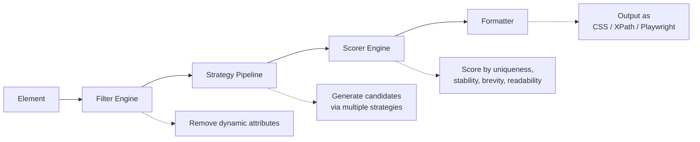

# stable-selector

> Generate unique, stable selectors for web elements

[](https://www.npmjs.com/package/stable-selector)
[](https://github.com/qaz1230sp/stable-selector/actions/workflows/ci.yml)
[](https://codecov.io/gh/qaz1230sp/stable-selector)
[](./LICENSE)
[](https://bundlephobia.com/package/stable-selector)

[中文文档](./README.zh-CN.md)

---

## Why stable-selector?

Modern front-end toolchains — CSS Modules, Styled Components, Emotion, Vue scoped styles — generate **dynamic class names and attributes** that change on every build. If your automated tests or web scrapers rely on these values, they break constantly.

**stable-selector** solves this by intelligently filtering out dynamic attributes and generating selectors based only on stable, meaningful properties. It understands the patterns used by popular frameworks and applies heuristic entropy analysis to catch unknown dynamic patterns.

## Features

- 🧠 **Smart 3-layer filtering** — Built-in rules for CSS Modules, Styled Components, Emotion, Webpack hashes, Vue scoped, React internals, Tailwind JIT; heuristic entropy detection; user-defined patterns
- 📦 **Multi-format output** — CSS Selector, XPath, and Playwright Locator in a single call
- 🔌 **Extensible strategy pipeline** — ID → Attribute → Structural → Text → Role, with configurable priority
- 🚫 **Configurable blacklist** — Exclude class names, IDs, or attributes by exact match, wildcard, or regex
- 🪶 **Zero dependencies** — Lightweight core with tree-shakeable ESM output

## Quick Start

```bash
npm install stable-selector
```

```typescript
import { getSelector } from 'stable-selector';

const result = getSelector(element);
// => { css: 'div[data-testid="user-card"]',
//      xpath: '//div[@data-testid="user-card"]',
//      playwright: '[data-testid="user-card"]' }
```

## Browser Script (Single JS File)

You can also load stable-selector directly in browsers without a bundler:

```html
<script src="https://cdn.jsdelivr.net/npm/stable-selector/dist/index.global.js"></script>
<script>
  const result = StableSelector.getSelector(document.querySelector('#target'));
  console.log(result);
</script>
```

## Output Formats

**CSS Selector:**

```typescript
const result = getSelector(element, { formats: ['css'] });
// => { css: '#user-card' }
```

**XPath:**

```typescript
const result = getSelector(element, { formats: ['xpath'] });
// => { xpath: '//*[@id="user-card"]' }
```

**Playwright Locator:**

```typescript
const result = getSelector(element, { formats: ['playwright'] });
// => { playwright: '[data-testid="user-card"]' }
```

## Configuration

Use `configure()` to set global options:

```typescript
import { configure } from 'stable-selector';

configure({
  filters: {
    blacklist: {
      classNames: ['ant-*', 'el-*', /^myapp-theme-/],
      ids: ['J_*', /^auto-id-/],
      attributes: ['data-spm*', 'data-bizid'],
    },
    heuristic: true,
    heuristicThreshold: 0.7,
  },
  priorities: ['id', 'attribute', 'structural', 'text', 'role'],
  formats: ['css', 'playwright'],
  maxDepth: 5,
});
```

## Per-call Options

Override global settings for individual calls:

```typescript
// Only get Playwright format for this call
const result = getSelector(element, {
  formats: ['playwright'],
});

// Add extra blacklist patterns for this call
const result = getSelector(element, {
  blacklist: { classNames: ['tmp-*'] },
});
```

## How It Works

stable-selector uses a four-stage pipeline:



1. **Filter Engine** removes unstable attributes using built-in patterns, entropy-based heuristic detection, and user-defined rules
2. **Strategy Pipeline** generates candidate selectors via ID, Attribute, Structural, Text, and Role strategies
3. **Scorer Engine** ranks candidates on 4 weighted dimensions: uniqueness (0.4), stability (0.35), brevity (0.15), readability (0.1)
4. **Formatter** converts the best candidate into the requested output format(s)

## Highlights

- **Dynamic attribute filtering** — 3-layer pipeline (built-in patterns, entropy-based heuristics, user-defined rules) keeps selectors stable across CSS Modules, Styled Components, Emotion, Vue scoped styles, Webpack hashes, Tailwind JIT, and more.
- **Multi-format output** — Generate CSS Selector, XPath, and Playwright Locator from a single call.
- **Scored ranking** — Each candidate is ranked on 4 weighted dimensions: uniqueness, stability, brevity, readability.
- **Extensible strategies** — Plug in or reorder ID / Attribute / Structural / Text / Role strategies via configuration.
- **TypeScript-first** — Fully typed public API, ESM + CJS + browser IIFE bundle out of the box.
- **Runs anywhere** — Works in modern browsers and Node-based test runners with zero runtime dependencies.

## API Reference

See the full [API documentation](./docs/api-reference.md).

## Contributing

Contributions are welcome! Please read the [Contributing Guide](./CONTRIBUTING.md) before submitting a pull request.

## License

[MIT](./LICENSE)
