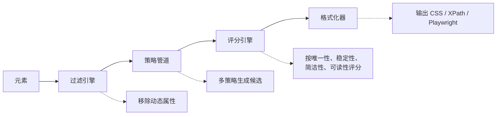

# stable-selector

> 为网页元素生成唯一、稳定的选择器

[](https://www.npmjs.com/package/stable-selector)
[](https://github.com/qaz1230sp/stable-selector/actions/workflows/ci.yml)
[](https://codecov.io/gh/qaz1230sp/stable-selector)
[](./LICENSE)
[](https://bundlephobia.com/package/stable-selector)

[English](./README.md)

---

## 为什么选择 stable-selector？

现代前端工具链 —— CSS Modules、Styled Components、Emotion、Vue scoped 样式 —— 会生成**动态的类名和属性**，每次构建都会变化。如果你的自动化测试或网页爬虫依赖这些值，它们会频繁失效。

**stable-selector** 通过智能过滤动态属性，仅基于稳定、有意义的属性生成选择器来解决这个问题。它能识别主流框架的动态模式，并通过启发式熵值分析捕获未知的动态模式。

## 特性

- 🧠 **智能三层过滤** —— 内置规则覆盖 CSS Modules、Styled Components、Emotion、Webpack hash、Vue scoped、React 内部属性、Tailwind JIT；启发式熵值检测；用户自定义规则
- 📦 **多格式输出** —— 一次调用同时获得 CSS 选择器、XPath、Playwright 定位器
- 🔌 **可扩展策略管道** —— ID → 属性 → 结构 → 文本 → 角色，优先级可配置
- 🚫 **可配置黑名单** —— 按精确匹配、通配符或正则排除类名、ID 或属性
- 🪶 **零依赖** —— 轻量核心，支持 Tree-shaking 的 ESM 输出

## 快速开始

```bash
npm install stable-selector
```

```typescript
import { getSelector } from 'stable-selector';

const result = getSelector(element);
// => { css: 'div[data-testid="user-card"]',
//      xpath: '//div[@data-testid="user-card"]',
//      playwright: '[data-testid="user-card"]' }
```

## 浏览器脚本（单独 JS 文件）

也可以不使用打包工具，直接在浏览器中通过单文件引入：

```html
<script src="https://cdn.jsdelivr.net/npm/stable-selector/dist/index.global.js"></script>
<script>
  const result = StableSelector.getSelector(document.querySelector('#target'));
  console.log(result);
</script>
```

## 输出格式

**CSS 选择器：**

```typescript
const result = getSelector(element, { formats: ['css'] });
// => { css: '#user-card' }
```

**XPath：**

```typescript
const result = getSelector(element, { formats: ['xpath'] });
// => { xpath: '//*[@id="user-card"]' }
```

**Playwright 定位器：**

```typescript
const result = getSelector(element, { formats: ['playwright'] });
// => { playwright: '[data-testid="user-card"]' }
```

## 配置

使用 `configure()` 设置全局选项：

```typescript
import { configure } from 'stable-selector';

configure({
  filters: {
    blacklist: {
      classNames: ['ant-*', 'el-*', /^myapp-theme-/],
      ids: ['J_*', /^auto-id-/],
      attributes: ['data-spm*', 'data-bizid'],
    },
    heuristic: true,
    heuristicThreshold: 0.7,
  },
  priorities: ['id', 'attribute', 'structural', 'text', 'role'],
  formats: ['css', 'playwright'],
  maxDepth: 5,
});
```

## 单次调用选项

为单次调用覆盖全局设置：

```typescript
// 本次只获取 Playwright 格式
const result = getSelector(element, {
  formats: ['playwright'],
});

// 本次追加黑名单规则
const result = getSelector(element, {
  blacklist: { classNames: ['tmp-*'] },
});
```

## 工作原理

stable-selector 使用四阶段管道架构：



1. **过滤引擎** 使用内置规则、基于熵值的启发式检测和用户自定义规则移除不稳定属性
2. **策略管道** 通过 ID、属性、结构、文本和角色策略生成候选选择器
3. **评分引擎** 在 4 个加权维度上对候选进行排序：唯一性 (0.4)、稳定性 (0.35)、简洁性 (0.15)、可读性 (0.1)
4. **格式化器** 将最佳候选转换为请求的输出格式

## 核心优势

- **动态属性过滤** —— 三层管道（内置规则、基于熵值的启发式检测、用户自定义规则）让选择器在 CSS Modules、Styled Components、Emotion、Vue scoped、Webpack hash、Tailwind JIT 等场景下保持稳定。
- **多格式输出** —— 一次调用同时生成 CSS 选择器、XPath、Playwright 定位器。
- **评分排序** —— 候选项在 4 个加权维度上排序：唯一性、稳定性、简洁性、可读性。
- **可扩展策略** —— 通过配置启用、重排 ID / 属性 / 结构 / 文本 / 角色 等策略。
- **TypeScript 优先** —— 公共 API 完整类型，开箱即用支持 ESM、CJS、浏览器 IIFE。
- **跨环境运行** —— 适用于现代浏览器与基于 Node 的测试框架，无运行时依赖。

## API 参考

查看完整 [API 文档](./docs/api-reference.md)。

## 贡献

欢迎贡献！请在提交 Pull Request 前阅读[贡献指南](./CONTRIBUTING.md)。

## 许可证

[MIT](./LICENSE)
